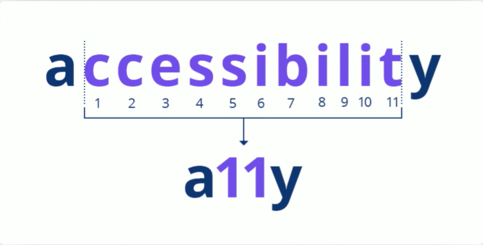

# accessibility = a11y

## What is accessibility ?

When websites and web tools are properly designed and coded, people with disabilities can use them. However, currently many sites and tools are developed with accessibility barriers that make them difficult or impossible for some people to use. Making the web accessible benefits individuals , businesses, and society.

## Reasons to learn Accessibility
- It's fun!
- We're the ones making the web inaccessible 
- Human Rights 
- Legal Issue
- Reach larger audience
- Impactful
- Makes you a specialist