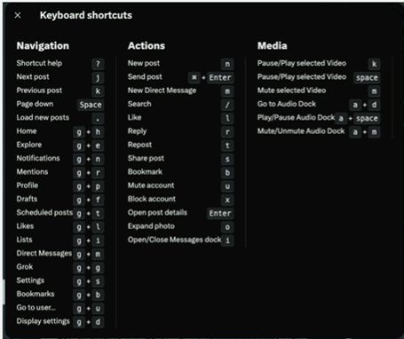

# accessibility = a11y


## What is accessibility ?

When websites and web tools are properly designed and coded, people with disabilities can use them. However, currently many sites and tools are developed with accessibility barriers that make them difficult or impossible for some people to use. Making the web accessible benefits individuals , businesses, and society.


### Reasons to learn Accessibility

- It's fun!
- We're the ones making the web inaccessible
- Human Rights
- Legal Issue
- Reach larger audience
- Impactful
- Makes you a specialist

## The Legal Landscape

### Web accessibility and the law (US focused)

- web accessibility is a legal requirement under the americans with disabilities act (ada)
- lawsuits & regulations are increasing
- non-compliance can result **fines**, **lawsuits**, and **reputational damage**


## Assistive Technologies

1. Keyboard Only
2. Head wand and mouth stick
3. Single Switch
4. Screen Readers
5. Eye tracker Keyboard

### The curb cut effect

The Curb-Cut Effect , in its essence , asserts that an investment in one group can cascade out and up
and be a substantial investment in the broader well-begin of a nation ...
one whose policies and practices healthy community of opportunity and just society.

## Standards and Guidelines

- Web Content Accessibility Guidelines (WCAG)
- The W3C Web Accessibility Initiative (WAI)
- Accessibility Rich Internet Application (WAI-ARIA)


## Screen Readers

### How do they work ?

Screen readers convert digital text into synthesized speech. They empower users to hear Content
and navigate with the keyboard. The technologies helps people who are blind or who have low vision to use
information technology with the same level of independence and privacy as anyone else.

### Alternative text

By default, when a screen reader encounters an image , if it can't find alt text it will read aloud the file's name.
This gets especially tricky for user generated images which often get hashed files names.

### Alt text

Adding an alt attribute will override that behavior. Screen readers will read the Alternative
text instead of the file name.

### Skipping over images

Sometimes your website will have image that are strictly for decorative purposes. In that case , an empty alt attribute will force the screen reader to skip over the image.

### A note one SEO

Search engines also make use of alternative text, For years SEO shops have suggested stuffing the keywords you want to rank for into alt text
whenever possible. This provides a very bad accessibility experience.

### Caption for audio

Remember note all content on the web is visual! if your application has video content, be sure to use a captioning service to add closed captioning.

## Semantic HTML

### Element have semantic meaning but no special functionality

- aside
- footer
- header

### Elements provide a lot of build-in functionality

- button
- input
- textarea

### Form Labels

Form fields can be confusing for screen reader users. There are many ways to
label form fields so the label is read out loud whenever the field has focus.

### Anti pattern - Visual only Labels

A common pattern is using div's or paragraph tags to label form fields.

```html
<form>
  <p>First Name</p>
  <input type="text" />
  <p>Last Name</p>
  <input type="text" />
  <p>Password</p>
  <input type="password" />
  <input type="submit" value="Submit" />
</form>
```

### HTML Labels

A better option is to use the HTML label tag which will allow screen readers to recite the label when the filed is focused.

```html
<form>
  <label for="first">First Name</label>
  <input id="first" type="text" />

  <label for="last">Last Name</label>
  <input id="last" type="text" />

  <label for="password">Password</label>
  <input id="password" type="password" />

  <input type="submit" value="Submit" />
</form>
```

### Implicit HTML Labels

Another cool trick you can do is wrap your inputs with the label tag. This is called implicit labelling.

```html
<form>
  <label>
    First Name
    <input id="first" type="text" />
  </label>

  <label for="last">
    Last Name
    <input id="last" type="text" />
  </label>

  <label for="password">
    Password
    <input id="password" type="password" />
  </label>

  <input type="submit" value="Submit" />
</form>
```

### Limitations with the label tag

The label tag can only work with label able elements.

- button
- input
- keygen
- meter
- output
- progress
- select
- textarea

### aria-label

if you ever need to label an elements not on that list. use aria-label instead.

```html
<div aria-label="Interactive div">Hello</div>
```

## Divs are not buttons

here is the button with the div

```html
<div onclick="alert('hello')">Click me!</div>
```

tell screen reader it's clickable

```html
<div role="button" onclick="alert('hello')">Click me!</div>
```

allow users to tab to it

```html
<div tabindex="0" role="button" onclick="alert('hello')">Click me!</div>
```

allow keyboard users to interact with it!

```html
<div
  tabindex="0"
  role="button"
  onclick="alert('hello')"
  onKeyup="alert('hello')"
>
  Click me!
</div>
```

tell screen readers what it does!

```html
<div
  aria-label="Alert the word hello"
  tabindex="0"
  role="button"
  onclick="alert('hello')"
  onKeyup="alert('hello')"
>
  Click me!
</div>
```

Or,just use a button

```html
<button onclick="alert('hello')">Click me!</button>
```

## Screen reader only content

Sometimes you'll want to communicate with a screen reader directly! One cool example
is announcing to screen reader users that you offer accessibility features! In that case you can make
some HTML and wrap it in a visually hidden class

```css
.visuallyhidden {
  position: absolute;
  left: 0;
  top: -500px;
  width: 1px;
  height: 1px;
  overflow: hidden;
}
```

## Focus Styles

Visible focus indicators are crucial for keyboard users. In this exercise,
you'll learn how to create clear, beautiful focus styles that meet WCAG requirement.

### Focus Style requirement

- Focus indicators must have a minimum contrast ratio of 3:1 against adjacent colors.
- Focus areas should be at least 2px thick
- Focus styles should be visible in both light and dark modes
- Consider using multiple indicators (outline + background change)
- Animations can enhance focus visibility but shouldn't be distracting

## Keyboard only users

- Your entire application should be usable with only the keyboard (form,buttons,etc)
- Some type of focus indicator should be used to provide a necessary clue as to the currently active item
- Consider offering a shortcut for keyboard-only users to jump quickly to the main content (a skip link)

### Keyboard Shortcuts

Keyboard Shortcuts are another curb cut example. Sites like Twitter and Facebook offer keyboard
Shortcuts for almost any action which are great for both keyboard only users and power users!



### Skip Links

Skip links help users skip over large headers and navigation and jump right into
the main content of your site. When user hits tab for the first time , button will appear and
offer users to jump right to the main section.

### How to make a skip link

- Create an anchor with the body Skip to content
- Prepend it to the body of your website
- Make it visually hidden
- Give it a focus state which makes it visible.

### Tab navigation

You cna use the tab key to navigate the next tabbable item and shift + tab
to navigate the previous item.

### Tabbable elements

- a
- button
- input
- select
- textarea
- iframe

### Making an element tabbable

you can add the tabindex attribute to any element like this:

```html
<div tabindex="0">I'm focusable</dib>
```

### Tabindex values

- a **negative** value means that the element should be focusable, but
  should not be reachable via sequential keyboard navigation;
- **0** means that the element should be focusable and reachable via
  sequential keyboard navigation, but its relative order is defined by
  the platform convention;
- a **positive** value means should be focusable and reachable via
  sequential keyboard navigation; its relative oder is defined by the
  value of the attribute: the sequential follow the increasing number of the
  tabindex. If several elements share the same tabindex, their
  relative oder follow their relative position in the document.


### Active Element

Sometimes , especially on single page applications, it's helpful to store
the currently focused element before a page transition so you can return
to it later.

### Tab trapping

Another useful concept is tab trapping. Consider opening a model on a
page which contains form. A keyboard only user will want to tab
around the form but unless we help, tabbing while focused on the last
form element will send us all the way back to the main document.

## WAI-ARIA vs WCAG

The main difference between WCAG and WAI-ARIA is that **WCAG sets**
the overall accessibility **standards** (like requiring sufficient color contrast),
while **WAI-ARIA provides techniques** to meet those standards, especially for complex,
dynamic content (like using the aria-label attribute to give a name to custom-build component)


### Labels, revisited

Earlier, we learned about the label tag in HTML and how it can be used
to labe** certain** form elements.

The ARIA spec provides us with great tools for labelling and describing
any element we want. The are

- aria-label
- aria-labelledby
- aria-describing

### Labelledby vs. describedby


## Roles, States and Properties

ARIA also provides roles which can be applied to any element. Example include:

- button
- checkbox
- tree
- banner
- aria-autocomplete
- aria-haspopup

### ARIA in css

ARIA Properties cna accessed in CSS!

```css
.dropdown[aria-expanded="false"] .icon::after {
  content: ">";
}
.dropdown[aria-expanded="true"] .icon::after {
  content: "<";
}
```

### Live Regions

Application cna become very dynamic. FOr cases where important
information could be coming in at any time, the ARIA spec provides the
ability to make an element as containing live data so that screen readers
can read out updates as they come.

### Politeness

The value that you pass to aria-live is politeness setting. You can pass in

- **assertive:** will interrupt whatever it's doing to announce.
- **polite:** will announce the live region update when it next idles.
- **off:** will not read the update.

## Testing and Tooling

- DevTools
- CI/CD audits
- Linters


